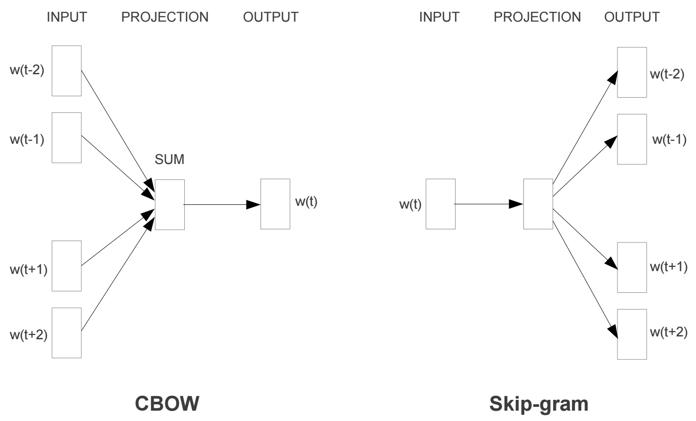

# Skip-Gram Word2Vec
Russian news classification with Skip-Gram

## Readings and References

* [Skip-gram tutorial](http://mccormickml.com/2016/04/19/word2vec-tutorial-the-skip-gram-model/) from Chris McCormick 
* [Word2Vec paper](https://arxiv.org/pdf/1301.3781.pdf) from Mikolov et al.
* [Neural Information Processing Systems, paper](http://papers.nips.cc/paper/5021-distributed-representations-of-words-and-phrases-and-their-compositionality.pdf) with improvements for Word2Vec also from Mikolov et al.
* A lot of material was taken from [Udacity](http://udacity.com/) Deep Learning Course 
* [Taiga corpus](https://tatianashavrina.github.io/taiga_site/downloads) was used for training

## Word2Vec

The Word2Vec algorithm finds much more efficient representations by finding vectors that represent the words. These vectors also contain semantic information about the words.

There are two architectures for implementing Word2Vec:
>* CBOW (Continuous Bag-Of-Words)
>* Skip-gram

We'll be using the **skip-gram architecture** with **negative sampling** because it performs better than CBOW and trains faster with negative sampling.
